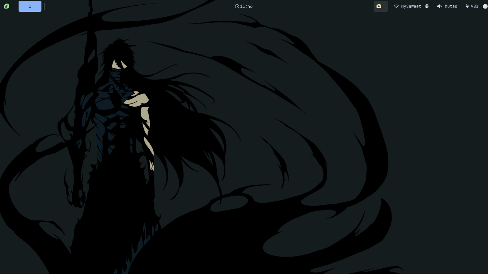
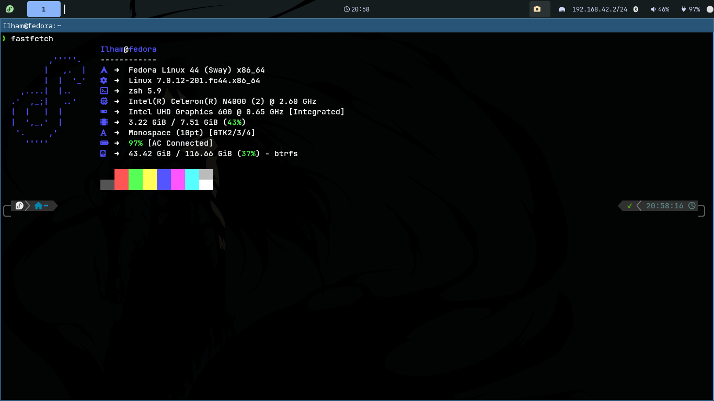
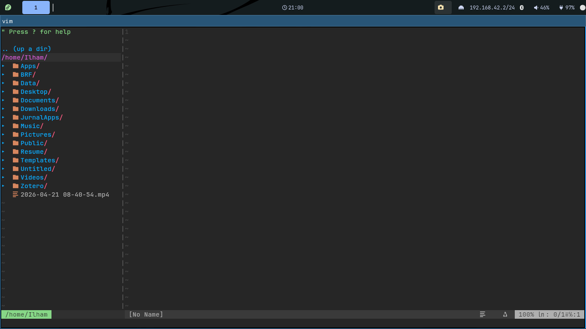

# DotFiles

Konfigurasi **fedora 44** dengan WM Tilling **Sway** 

Dibuat dengan app **stow** untuk menyimpan dan memilih konfigurasi yang cocok untuk di backup

## Data Konfigurasi

Konfigurasi yang ada :
1. Sway + Waybar
2. FastFetch
3. Vim

## Tampilan Konfigurasi 

### Sway + Waybar

## Fastfetch

## Vim 

